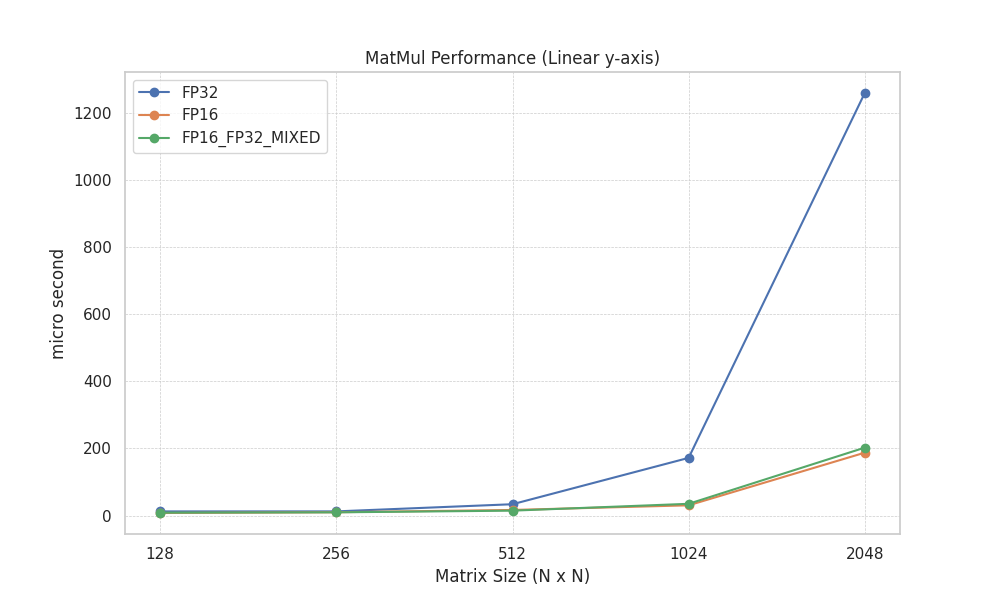
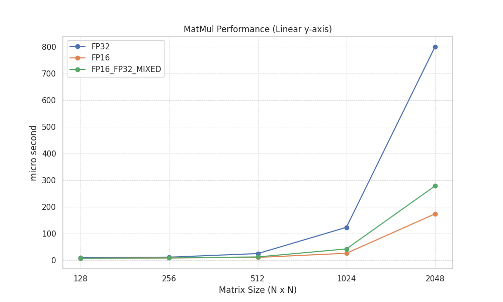
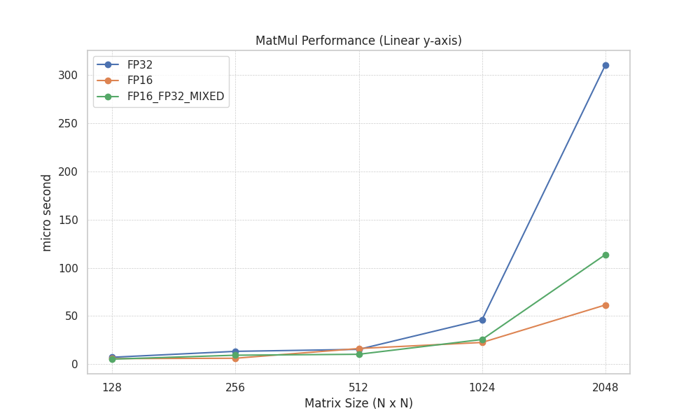
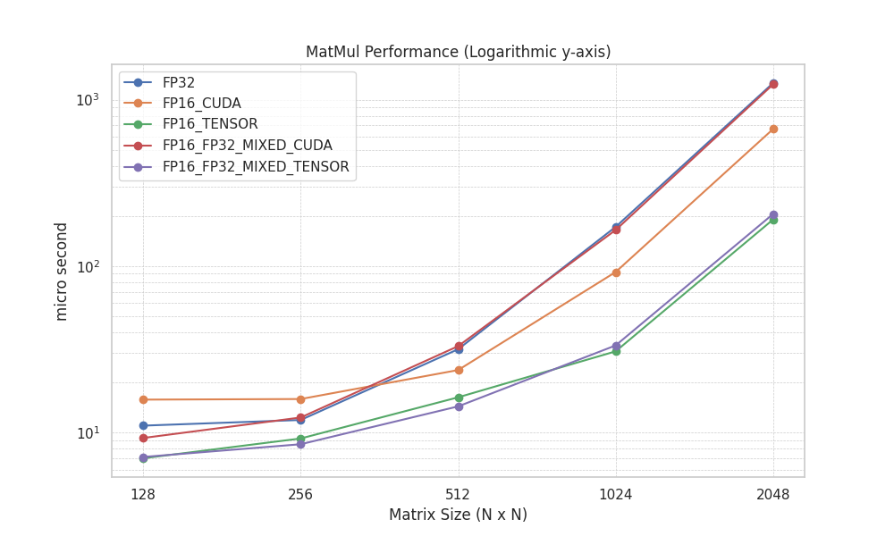
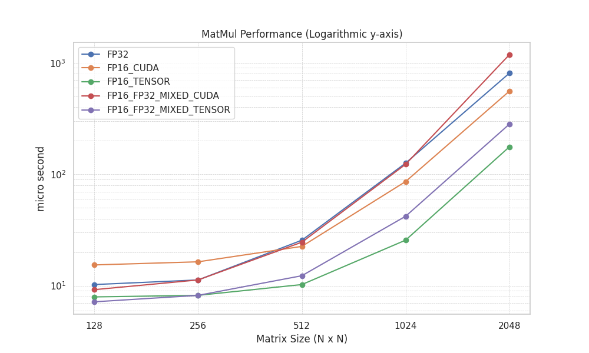
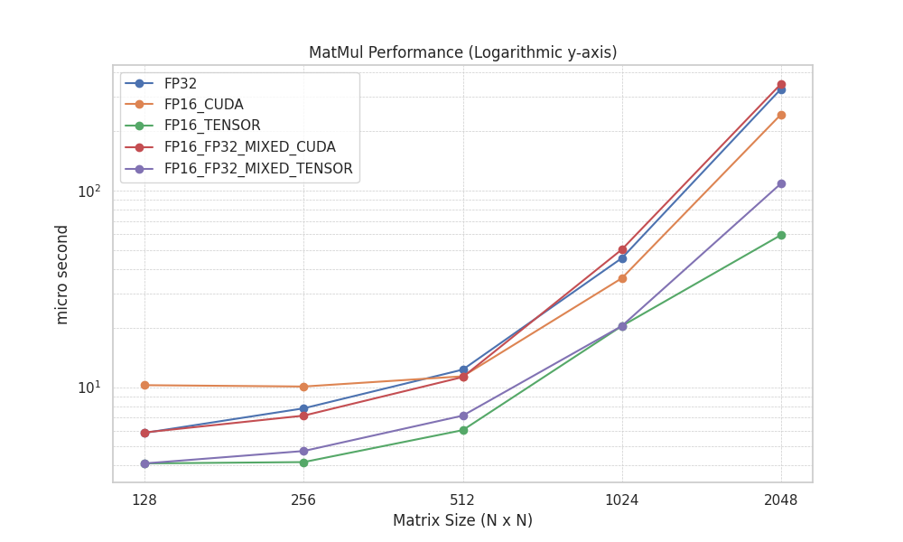

# 概要
cuBLASを用いたMatMulのパフォーマンスを測定します。  
各行列サイズ`(16, 32, 64, 128, 256, 512, 1024, 2048)`に対して任意の回数実行時間を測定して、中央値を出力します。  
`titan RTX`, `RTX3090`, `RTX4090`に対応しています。その他を追加する場合は`CMakeLists.txt`の`CMAKE_CUDA_ARCHITECTURES`に対応する値を追加してください。  

# Require
- CUDA
- g++
- CMake
- python
    - seaborn
    - matplotlib
    - pandas

# How To Use

```bash
mkdir build
cd build
cmake .. && make
./main
```

実行時引数を渡すことでloop回数を変更できます。
```bash
./main 1000
```

plot.pyでresultsからグラフを生成します。

自分用

コードを変更していない場合
```bash
cd build && make && ./main 100000 && cd .. && python3 plot.py
```

## Performance


### Linear-scale
#### titan

#### 3090

#### 4090


### Log-scale
#### titan

#### 3090

#### 4090
